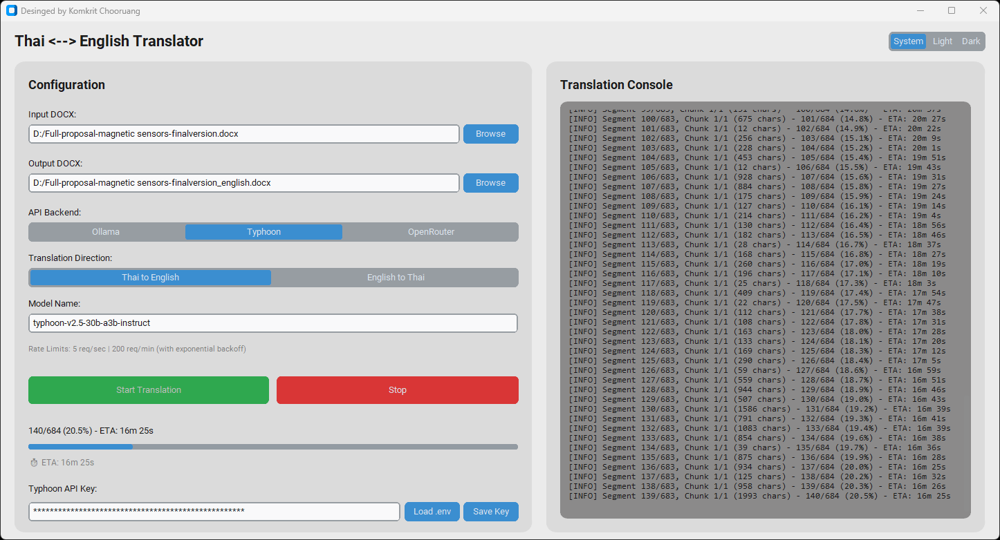

# Thai ↔ English AI Document Translator

> โปรแกรมแปลเอกสาร Word (DOCX) ด้วย AI แบบอัตโนมัติทั้งไฟล์  
> ไม่ต้องเสียเวลาคัดลอกและวางข้อความทีละย่อหน้าเข้า ChatGPT หรือ AI อื่น ๆ อีกต่อไป



---

# ภาพรวม

Thai ↔ English AI Document Translator เป็นโปรแกรมสำหรับแปลเอกสาร Microsoft Word (.docx) ขนาดใหญ่ด้วยเทคโนโลยี Large Language Models (LLMs)

โปรแกรมสามารถอ่านเอกสารทั้งฉบับ แบ่งข้อความอัตโนมัติ ส่งไปแปลด้วย AI และสร้างไฟล์ DOCX ที่แปลแล้วกลับมาให้ โดยยังคงโครงสร้างเอกสารเดิมไว้ให้มากที่สุด

เหมาะสำหรับ

- ข้อเสนอโครงการวิจัย
- วิทยานิพนธ์
- บทความวิชาการ
- รายงานทางเทคนิค
- เอกสารราชการ
- คู่มือการใช้งาน
- รายงานธุรกิจ

---

# ทำไมต้องใช้โปรแกรมนี้?

## วิธีเดิม

❌ เปิดไฟล์ Word

❌ คัดลอกข้อความทีละย่อหน้า

❌ วางลงใน ChatGPT

❌ คัดลอกผลลัพธ์กลับเข้า Word

❌ ทำซ้ำหลายร้อยครั้ง

เอกสารวิจัยขนาด 100 หน้า อาจต้อง Copy & Paste มากกว่า 500–1000 ครั้ง

---

## วิธีใหม่

✅ เลือกไฟล์ DOCX

✅ เลือกโมเดล AI

✅ กด Start Translation

✅ รอประมวลผล

✅ ได้ไฟล์ DOCX ภาษาใหม่ทันที

---

# คุณสมบัติเด่น

## รองรับ AI หลายแพลตฟอร์ม

### Ollama

ทำงานบนเครื่องของคุณทั้งหมด

- ไม่ส่งข้อมูลขึ้น Cloud
- ไม่มีค่าใช้จ่ายต่อการใช้งาน
- เหมาะสำหรับเอกสารลับหรือข้อมูลวิจัย

### Typhoon

ใช้โมเดลภาษาไทยคุณภาพสูงจาก SCB 10X

### OpenRouter

เชื่อมต่อโมเดลชั้นนำ เช่น

- GPT-4o
- Claude
- Gemini
- DeepSeek
- Llama
- Qwen

---

## รองรับการแปล 2 ทิศทาง

### ไทย → อังกฤษ

เหมาะสำหรับ

- งานวิจัย
- Proposal
- Journal Paper
- Thesis

### อังกฤษ → ไทย

เหมาะสำหรับ

- บทความวิชาการ
- เอกสารอ้างอิง
- คู่มือทางเทคนิค

---

## แบ่งข้อความอัตโนมัติ (Smart Chunking)

โปรแกรมสามารถ

- แบ่งข้อความขนาดใหญ่ให้อัตโนมัติ
- รักษาขอบเขตประโยค
- ป้องกัน Token Overflow
- เพิ่มคุณภาพการแปล

ผู้ใช้ไม่จำเป็นต้องแบ่งข้อความเอง

---

## รักษาโครงสร้างเอกสาร

รองรับ

- หัวข้อ (Heading)
- ย่อหน้า
- ตาราง
- ตารางซ้อน
- รูปแบบเอกสารเดิม (บางส่วน)

---

## แสดงความคืบหน้าแบบ Real-Time

ระหว่างการแปลสามารถดูได้ว่า

- แปลไปแล้วกี่ส่วน
- เปอร์เซ็นต์ความคืบหน้า
- เวลาโดยประมาณที่เหลือ (ETA)
- Log การทำงาน
- จำนวน API Calls

---

## ส่วนติดต่อผู้ใช้สมัยใหม่

พัฒนาด้วย CustomTkinter

รองรับ

- Dark Mode
- Light Mode
- System Theme

---

## ระบบจัดการ Rate Limit

มีระบบ

- Retry อัตโนมัติ
- Exponential Backoff
- Rate Limiting
- Error Recovery

ช่วยลดปัญหาการถูกจำกัดจำนวนคำขอจาก API

---

# โมเดลที่แนะนำ

## Ollama

แนะนำสำหรับการแปลไทย ↔ อังกฤษ

```bash
ollama pull scb10x/typhoon-translate1.5-4b
```

จากนั้นเลือกโมเดล

```text
scb10x/typhoon-translate1.5-4b:latest
```

---

## Typhoon API

ตัวอย่าง

```text
typhoon-v2.5-30b-a3b-instruct
```

---

## OpenRouter

ตัวอย่าง

```text
openai/gpt-4o
anthropic/claude-sonnet-4
google/gemini-2.5-pro
deepseek/deepseek-v4-flash
```

---

# การติดตั้ง

## Clone Repository

```bash
git clone https://github.com/yourusername/thai-english-translator.git

cd thai-english-translator
```

---

## สร้าง Virtual Environment

Windows

```bash
python -m venv venv

venv\Scripts\activate
```

Linux

```bash
python3 -m venv venv

source venv/bin/activate
```

---

## ติดตั้ง Library

```bash
pip install -r requirements.txt
```

หรือ

```bash
pip install python-docx python-dotenv tqdm tenacity customtkinter requests openai
```

---

# วิธีใช้งาน

## โหมด GUI

```bash
python translate_docx.py
```

---

## โหมด Command Line

### ไทย → อังกฤษ

```bash
python translate_docx.py \
--input proposal.docx \
--output proposal_english.docx \
--direction thai-to-english
```

### อังกฤษ → ไทย

```bash
python translate_docx.py \
--input paper.docx \
--output paper_thai.docx \
--direction english-to-thai
```

---

# การตั้งค่า API Key

## Typhoon

สร้างไฟล์ .env

```env
TYPHOON_API_KEY=your_api_key
```

---

## OpenRouter

```env
OPENROUTER_API_KEY=your_api_key
```

---

หรือสามารถ

- Load จาก .env
- Save Key
- ใช้งานซ้ำอัตโนมัติ

---

# ตัวอย่างการใช้งาน

## แปล Proposal ภาษาไทยเป็นภาษาอังกฤษ

1. เปิดโปรแกรม
2. เลือกไฟล์ DOCX
3. เลือก Ollama หรือ Typhoon
4. เลือกโมเดล
5. กด Start Translation
6. รอจนเสร็จ
7. ได้ไฟล์ Proposal ภาษาอังกฤษพร้อมใช้งาน

---

# ข้อดีเมื่อเทียบกับการใช้ ChatGPT แบบ Copy-Paste

| คุณสมบัติ | Copy-Paste เอง | โปรแกรมนี้ |
|------------|------------|------------|
| แปลทั้งไฟล์ DOCX | ❌ | ✅ |
| แบ่งข้อความอัตโนมัติ | ❌ | ✅ |
| รองรับตาราง | ❌ | ✅ |
| รักษาโครงสร้างเอกสาร | ❌ | ✅ |
| แสดง ETA | ❌ | ✅ |
| รองรับ Batch Translation | ❌ | ✅ |
| ใช้งาน Local AI | ❌ | ✅ |
| กดครั้งเดียวจบ | ❌ | ✅ |

---

# เหมาะสำหรับ

## นักวิจัย

- Proposal
- Journal
- Conference Paper
- Thesis

## อาจารย์มหาวิทยาลัย

- เอกสารการสอน
- งานวิจัย
- รายงานโครงการ

## นักศึกษา

- วิทยานิพนธ์
- สารนิพนธ์
- โครงงาน

## ภาคอุตสาหกรรม

- คู่มือ
- รายงาน
- เอกสารเทคนิค

---

# ผู้พัฒนา

ผู้ช่วยศาสตราจารย์ ดร.กมกฤต ชูเรือง

ภาควิชาวิศวกรรมไฟฟ้า  
คณะวิศวกรรมศาสตร์  
มหาวิทยาลัยนครพนม

---

# License

MIT License

---

# สรุป

Thai ↔ English AI Document Translator ช่วยให้การแปลเอกสาร Word ขนาดใหญ่เป็นเรื่องง่าย

ไม่ต้อง Copy → Paste ทีละย่อหน้าเข้า ChatGPT อีกต่อไป

เพียงเลือกไฟล์ กดปุ่มเดียว แล้วรอรับไฟล์ DOCX ที่แปลเสร็จสมบูรณ์

🚀 ประหยัดเวลาหลายชั่วโมงในการแปลเอกสารวิจัยและงานวิชาการ
